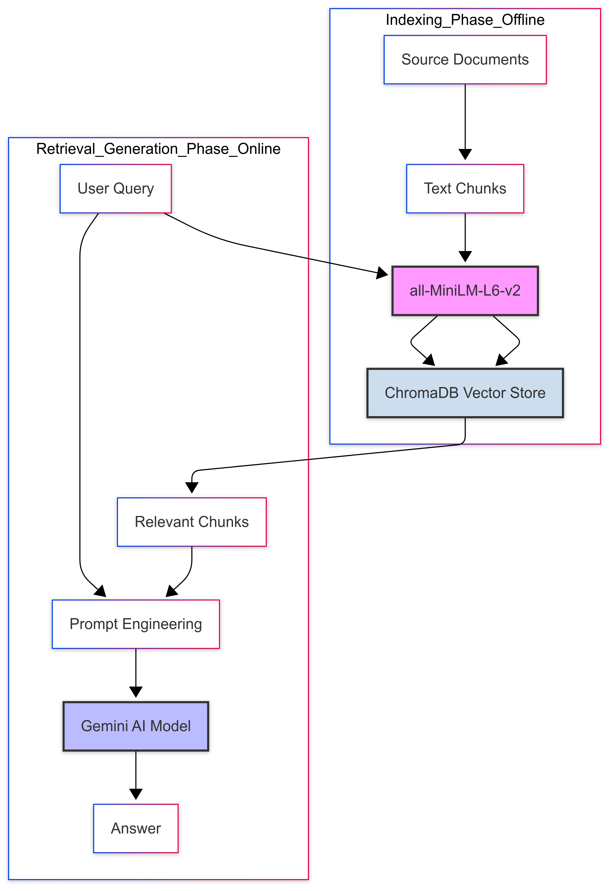

# Customer Support Analyzer

**It uses a Retrieval-Augmented Generation (RAG) architecture to answer questions based on a knowledge base of historical support tickets.

## Core Technologies

* **Backend Framework**: FastAPI
* **Frontend Frameworks**: NextJS, ReactJS
* **Vector Database**: ChromaDB
* **Embedding Model**: all-MiniLM-L6-v2 (via Sentence Transformers)
* **LLM for Generation**: gemini-1.5-flash-latest
* **Configuration**: python-dotenv

## Architecture

The system follows a classic two-phase RAG pipeline:

### 1. Indexing

1. Fetch real time support tickets from platforms like zendesk/JIRA.
2. Split each ticket into text chunks.
3. Generate vector embeddings for each chunk using `all-MiniLM-L6-v2`.
4. Store the chunks and their embeddings in a ChromaDB collection.

### 2. Retrieval & Generation

1. User sends a natural language query to the FastAPI endpoint.
2. The system converts the query into an embedding.
3. Perform a similarity search over the ChromaDB vector store to find the most relevant chunks.
4. Assemble the retrieved context with the original query and pass it to the Google Gemini Pro model.
5. Receive and return a concise, natural language answer.

